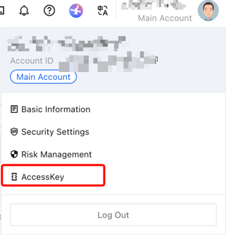
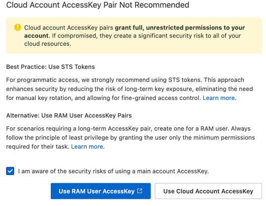
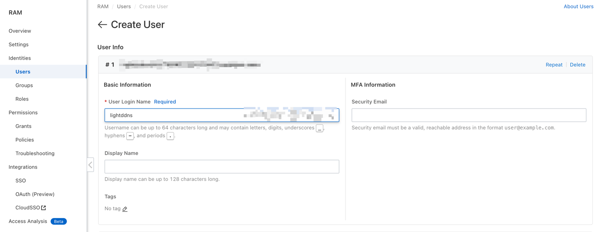
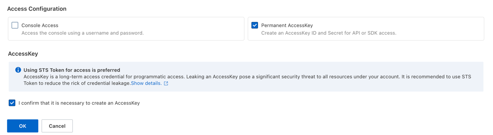
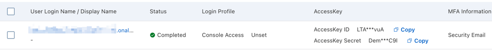
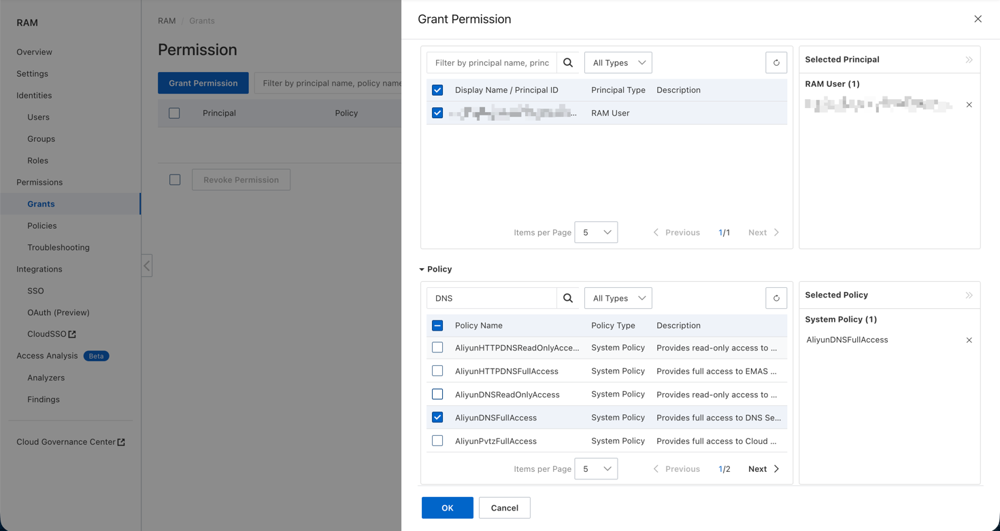

# Aliyun


Aliyun authenticates with an AccessKeyId and an AccessKeySecret.

[Aliyun DNS Console](https://dnsnext.console.aliyun.com/authoritative)

[Aliyun RAM User Console](https://ram.console.aliyun.com/)

[Aliyun Account AccessKey Page](https://ram.console.aliyun.com/profile/access-keys)

## Creating an AccessKey
??? note "Prerequisites"
	This guide creates the AccessKey from a personal computer. Make sure you have
	a computer connected to the internet and a working browser before you begin.

!!! note "This guide reflects a point in time"
	Written on June 9, 2026. The Aliyun console may change over time. If you spot
	a discrepancy, please [open an issue](https://github.com/duakc/lightddns/issues/new/choose)
	or [send a pull request](https://github.com/duakc/lightddns/pulls).

There are two ways to obtain an AccessKeyId / AccessKeySecret pair: through an Aliyun RAM user, or through the global account AccessKey **(not recommended)**.

Log in to your Aliyun account and hover (don't click) over the top-right area of the page, then click **AccessKey**.



You will be prompted to choose between `Use RAM User AccessKey` and `Use Cloud Account AccessKey`.



!!! note
	Prefer the RAM user AccessKey over the cloud account AccessKey. See the
	[official documentation](https://www.alibabacloud.com/help/en/ram) for the
	differences between the two.

### Using a RAM user AccessKey
Click `Use RAM User AccessKey`.

In the RAM user console, choose `Identity Management` -> `Users` -> `Create User` from the left sidebar.
Fill in a login name — this guide uses `lightddns`.



Since we need the AccessKey to call the API, check `Permanent AccessKey access`.



You'll be redirected to the AccessKey page. Copy both the AccessKeyId and the AccessKeySecret into a local file, a `.env` file, or directly into the Lightddns config.



After creating the RAM user you still need to grant it permissions.
Click `Permission Management` -> `Grant Permission` -> `Add Permission` in the left sidebar.

In the panel that opens on the right, pick the RAM user you just created.
Search for `DNS` and grant the user the `AliyunDNSFullAccess` policy.



### Using the cloud account AccessKey
Click `Use Cloud Account AccessKey`.

Click `Create AccessKey`. After confirmation, a new AccessKeyId / AccessKeySecret pair is generated.

Copy both into a local file, a `.env` file, or directly into the Lightddns config.

## Config file
```yaml
log:
  level: warn

datasources:
  - type: http
    url: https://ip.sb

providers:
  - type: aliyun
    accessKeyId: "{{ .Env.ALIYUN_ACCESS_KEY_ID }}"
    accessKeySecret: "{{ .Env.ALIYUN_ACCESS_KEY_SECRET }}"

domains:
  - enabled: true
    domain: ddns.example.com
```


!!! note
    Aliyun DNS resolves the parent zone from the FQDN — `ddns.example.com` maps to the zone `example.com`. The zone must already exist in your Aliyun DNS console.