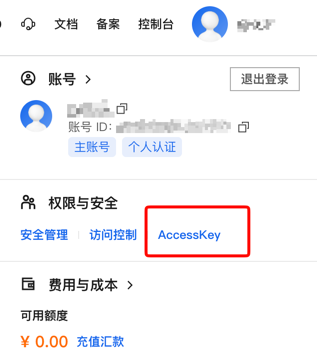
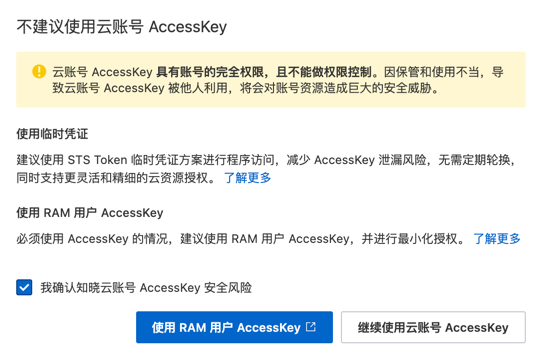
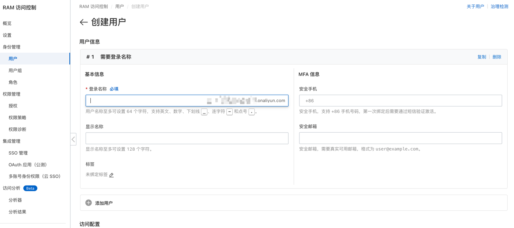
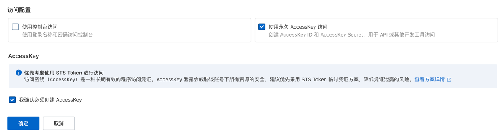
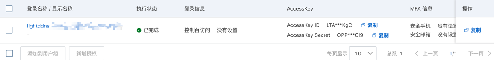
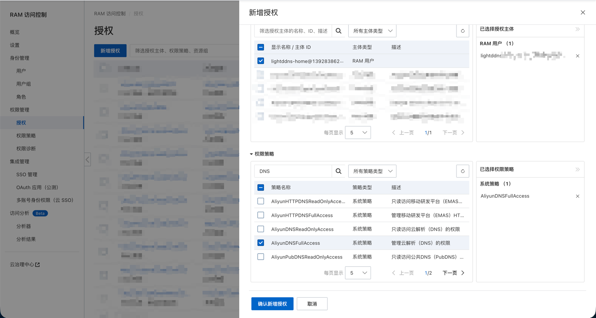

# 阿里云


阿里云使用 AccessKeyId 和 AccessKeySecret 来获取权限。

[阿里云 DNS控制台](https://dnsnext.console.aliyun.com/authoritative)

[阿里云 RAM用户管理控制台](https://ram.console.aliyun.com/)

[阿里云 云账户AccessKey管理页面](https://ram.console.aliyun.com/profile/access-keys)

## 申请 AccessKey
??? note "环境要求"
	本文使用个人电脑来进行 AccessKey 的申请，
	请确保你在阅读本文的时候拥有一个连接到网络的电脑和一个可以使用的浏览器。

!!! note "本文具有时效性"
	本文撰写于 2026年6月9日，文中内容可能随着时间变化，如遇到和本文有出入的地方可以给本项目在 Github
	[开启 Issue](https://github.com/duakc/lightddns/issues/new/choose) 或者 [提交 Pull Request](https://github.com/duakc/lightddns/pulls).

申请 AccessKeyId 和 AccessKeySecret 有两种方案：使用阿里云 RAM 用户的 AccessKey，或使用账号全局 AccessKey **(不推荐)**。

首先登录您的阿里云账号，将鼠标指针移动到网页右上角部分(不要点击)，然后鼠标选择 AccessKey。



然后会提示选择 `使用 RAM 用户 AccessKey` / `继续使用云账号 AccessKey`。



!!! note
	推荐使用 RAM 用户 AccessKey，而不是云账号 AccessKey。
	两者的区别可查看[官方文档](https://help.aliyun.com/zh/ram)。

### 使用 RAM 用户申请 AccessKey
选择 `使用 RAM 用户 AccessKey`。

打开 RAM 用户控制页面，在左侧侧边栏选择 `身份管理` -> `用户` -> `创建用户`。
填入登录名称，本文使用 `lightddns` 作为用户名。



因为我们需要 AccessKey 来调用 API ，所以勾选上 `使用永久 AccessKey 访问`。



创建完成后应该会自动跳转到展示 AccessKey 页面，复制 AccessKeyId 和 AccessKeySecret 到你本地一个文件或者到 .env 文件或者到配置文件中。



创建完 RAM 用户后，还需要为它添加相应的权限。
点击左边侧边栏 `权限管理` -> `授权` -> `新增授权`。

在右侧弹出的页面中选择刚刚创建的 RAM 用户。
搜索 `DNS`，给予 RAM 用户 `AliyunDNSFullAccess` 权限。



### 使用云账号 AccessKey
选择 `继续使用云账号 AccessKey`。

点击 `创建AccessKey`，确认后即会生成一对 AccessKeyId 和 AccessKeySecret。

复制 AccessKeyId 和 AccessKeySecret 到你本地一个文件或者到 .env 文件或者到配置文件中即可。

## 配置文件
```yaml
log:
  level: warn

datasources:
  - type: http
    url: https://ip.sb

providers:
  - type: aliyun
    accessKeyId: "{{ .Env.ALIYUN_ACCESS_KEY_ID }}"
    accessKeySecret: "{{ .Env.ALIYUN_ACCESS_KEY_SECRET }}"

domains:
  - enabled: true
    domain: ddns.example.com
```


!!! note
    阿里云解析会从 FQDN 提取父域 — `ddns.example.com` 对应的 Zone 是 `example.com`，请确认该 Zone 已经在阿里云解析控制台中存在。